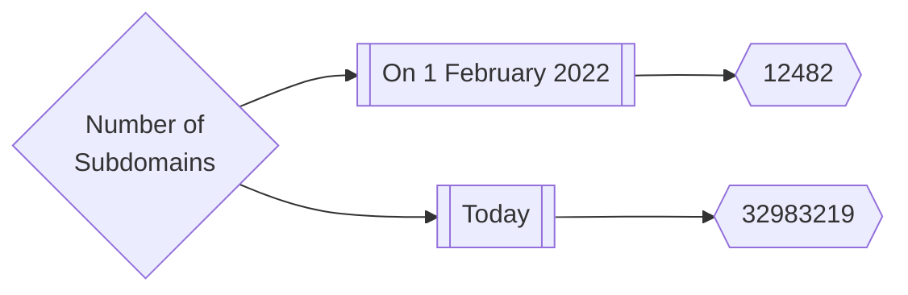
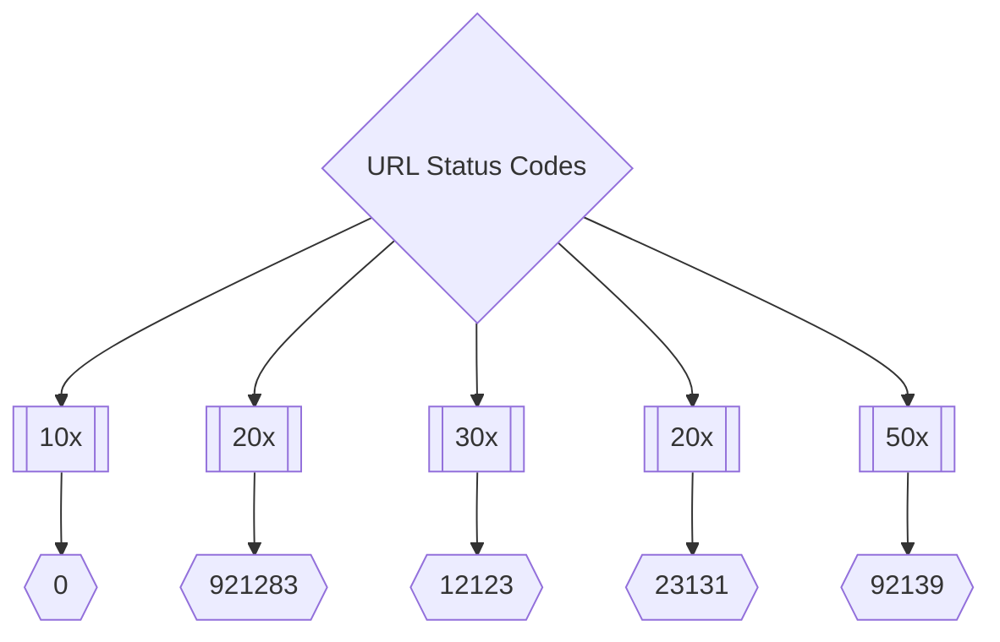
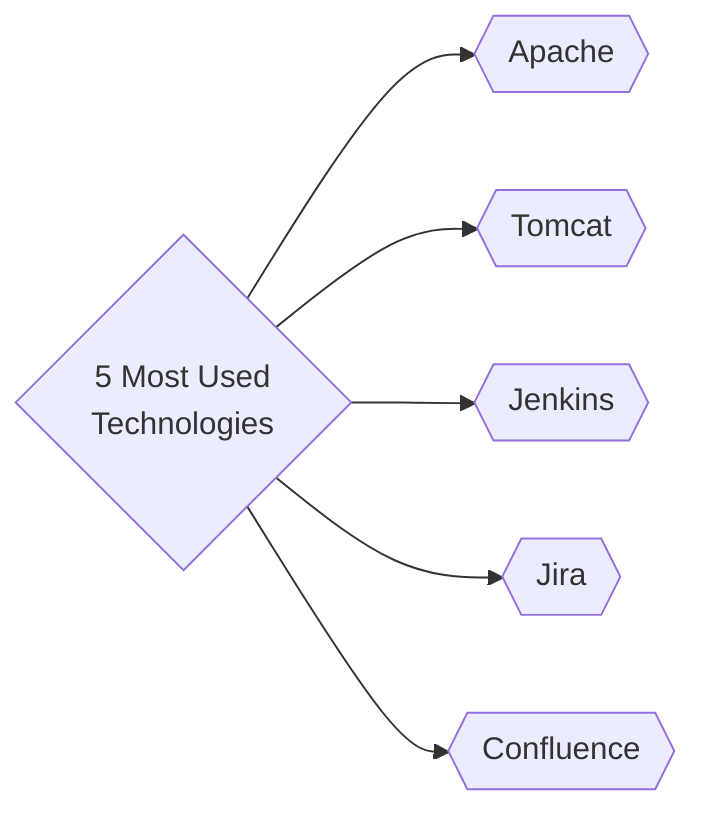
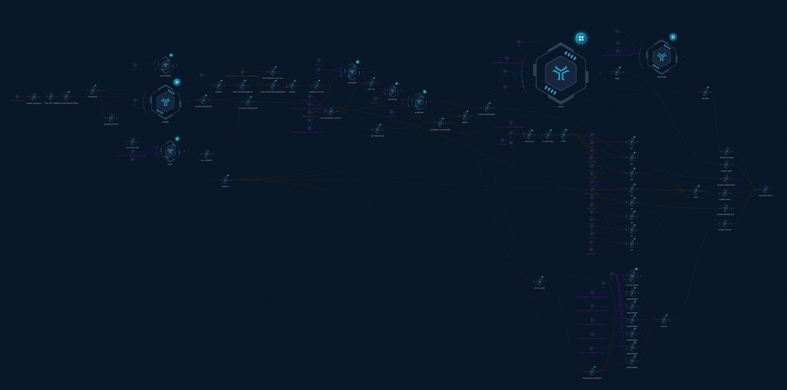
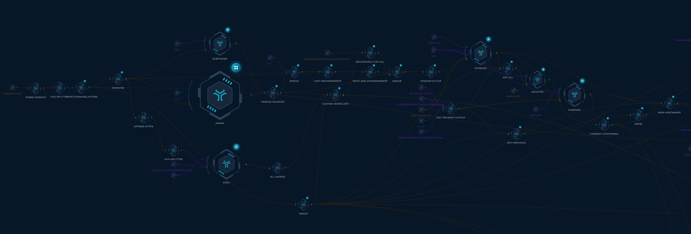
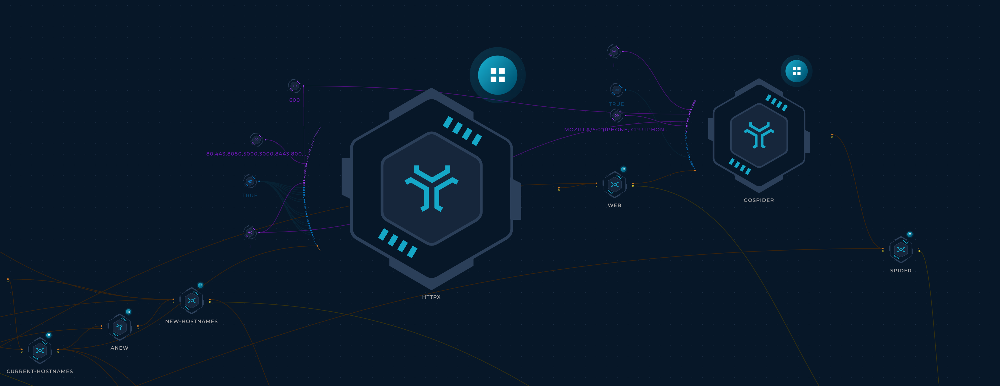
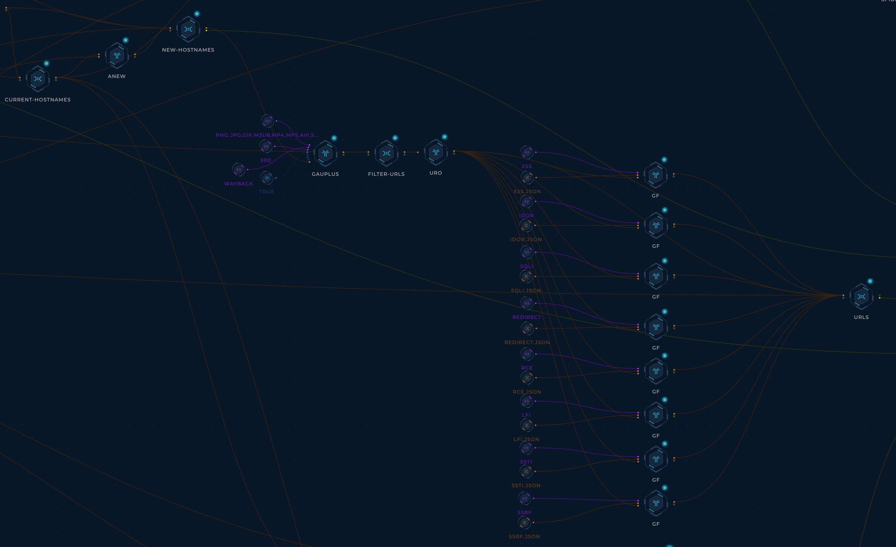
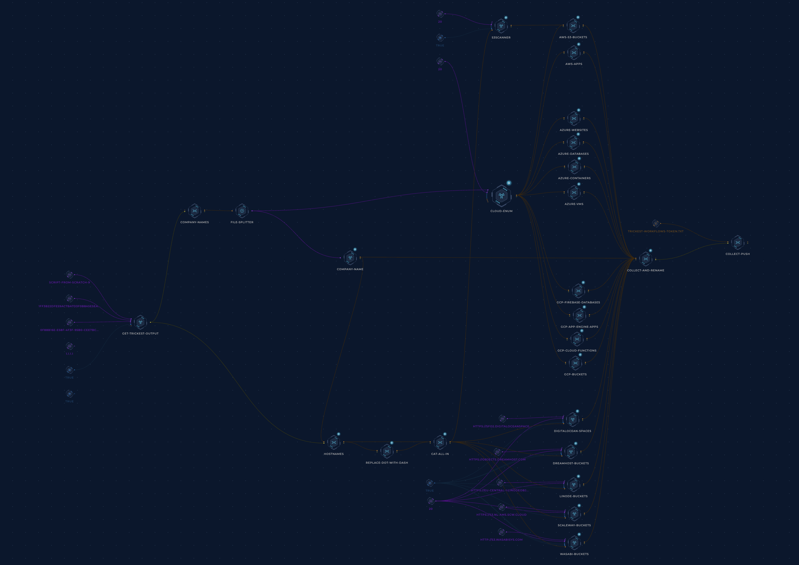
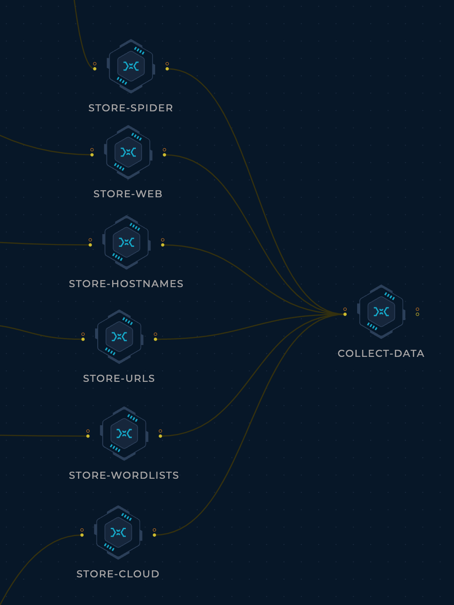

<h1 align="center">Inventory <a href="https://twitter.com/intent/tweet?text=CVE%20PoC%20-%20Find%20almost%20every%20publicly%20available%20CVE%20Proof-of-Concept%2E%0Ahttps%3A%2F%2Fgithub%2Ecom%2Ftrickest%2Fcve%0A&hashtags=cve,poc,vulnerability,vulnerabilities,exploit,infosec,cybersecurity"></a></h1>
<h3 align="center">Asset Inventory of public bug bounty programs</h3>

The data we collect here includes subdomains, URLs, web servers, cloud assets, and a lot more data on public bug bounty programs. Our aim with this project is to:
- help bug bounty programs get up and running on new programs as quickly as possible.
- give security teams better visibility into their assets.
- reduce the load and noise that some programs face from automated tools (we run them once, give the results to everyone)

## Statistics


---



---



---

## How it works
We have selected a few popular, public bug bounty programs as a start (open to [suggestions](#contribution)!). A [Trickest](https://trickest.com) workflow picks up these targets, collects data on them, enritches it, cleans it up, and pushes it to this repository.


### TB; DZ (Too big; didn't zoom)
#### Hostnames

- Get the list of targets from [targets.json](targets.json)
- For each target:
    - Use [subfinder](https://github.com/projectdiscovery/subfinder), [haktrails](https://github.com/hakluke/haktrails), and [amass](https://github.com/OWASP/Amass) to collect subdomains from passive OSINT sources (Thanks [ProjectDiscovery](https://github.com/projectdiscovery), [hakluke](https://github.com/hakluke), [OWASP](https://github.com/OWASP), and [Jeff Foley](https://github.com/caffix)!)
    - Pass the fonud passive subdomains to [dsieve](https://github.com/trickest/dsieve) to collect their `main environments` (e.g. foo.admin.example.com -> admin.example.com; this will help generate more permutations later).
    - Use CeWL(https://github.com/digininja/CeWL) to crawl the main domain and generate a custom wordlist (Thanks [digininja](https://github.com/digininja)).
    - Combine everything found so far into one `wordlist`.
    - Use [mksub](https://github.com/trickest/mksub) to merge the `wordlist` and the `main environments` and generate DNS names.
    - Resolve DNS names using [puredns](https://github.com/d3mondev/puredns) (Thanks [d3mondev](https://github.com/d3mondev)).
    - Generate permutations using [gotator](https://github.com/Josue87/gotator) (Thanks [Josue87](https://github.com/Josue87)).
    - Resolve permutated DNS names using [puredns](https://github.com/d3mondev/puredns).

---

#### Web Servers

- For each target:
    - Probe subdomains using [httpx](https://github.com/projectdiscovery/httpx) to find live web servers and collect their:
        - HTTP titles
        - Status codes
        - Content lengths
        - Content types
        - Final redirect locations
        - Webservers
        - Technologies
        - IP addresses
        - CNAMEs
    - Parse httpx's output and organize it into a few files for easier navigation.
    - Crawl the found websites using [gospider](https://github.com/jaeles-project/gospider) (Thanks [jaeles-project](https://github.com/jaeles-project/gospider))

---

#### URLs

- For each target:
    - Collect URLs using [gauplus](https://github.com/bp0lr/gauplus) (Thanks [bp0lr](https://github.com/bp0lr/gauplus))
    - Use [gf](https://github.com/tomnomnom/gf) and [gf-patterns](https://github.com/1ndianl33t/Gf-Patterns) to cateogr
    - Save each pattern's URLs to its own file for easier navigation.

---

#### Cloud Resources

- For each target:
    - Collect cloud resources using [cloud_enum](https://github.com/initstring/cloud_enum) (Thanks [initstring](https://github.com/initstring/cloud_enum))
    - Collected resources include
        - AWS S3 buckets 
        - AWS apps
        - Azure websites
        - Azure databases
        - Azure containers
        - Auzre VMs
        - GCP Firebase databases
        - GCP App Enginee apps
        - GCP Cloud Functions
        - GCP Storage buckets
    - Use [S3Scanner](https://github.com/sa7mon/S3Scanner) to bruteforce S3-compatible buckets (using the subdomains collected in [Hostnames](#hostnames) to seed the wordlist)
    - Collected buckets include:
        - AWS S3 buckets
        - DigitalOcean Spaces
        - DreamHost buckets
        - Linode buckets
        - Scaleway buckets
        - Wasabi buckets
    - Save each type of resource to its own file for easier navigation.

---

#### Collect and store
In the end, we deduplicate and merge the results of this workflow execution with the previous executions and push them to this repository.



> **As described, almost everything in this repository is generated automatically. We carefully designed the workflows (and continue to develop them) to ensure the results are as accurate as possible.**

## Custom Usage
You can use `trickest-cli` (public release soon!) to run this workflow on a custom target(s) using the following command
```
trickest execute Inventory --targets targets.json
```

## Contribution
All contribtutions/ideas/suggestions are welcome! If you want to add/edit a target/workflow, feel free to create a new ticket via [GitHub issues](https://github.com/trickest/cve/issues), tweet at us [@trick3st](https://twitter.com/trick3st), or join the conversation on [Discord](#).

## Build your own workflows
We believe in the value of tinkering. Sign up for a demo on [trickest.com](https://trickest.com) to customize this workflow to your use case, get access to many more workflows, or build your own from scratch!
