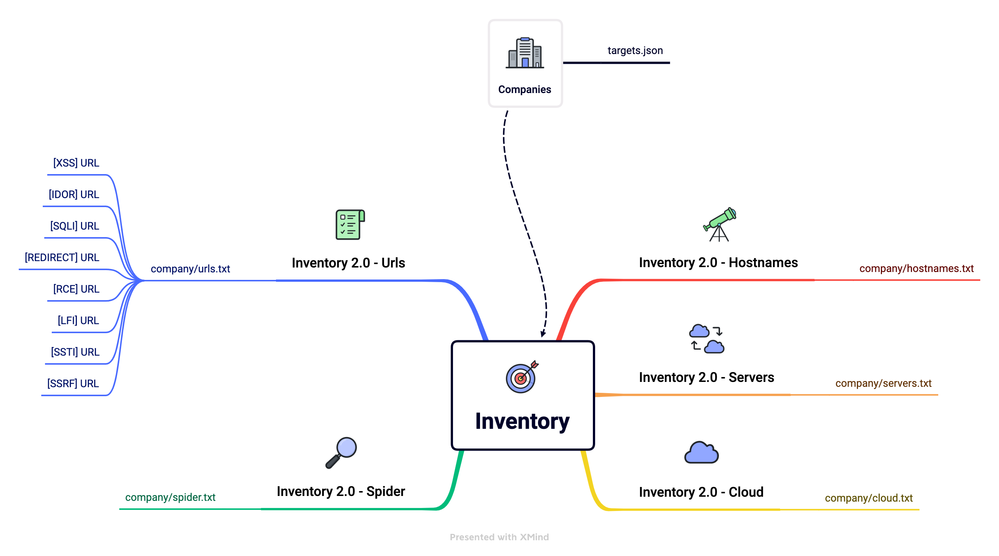
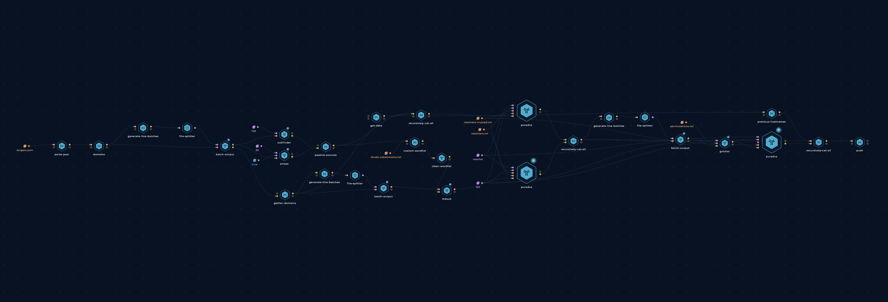
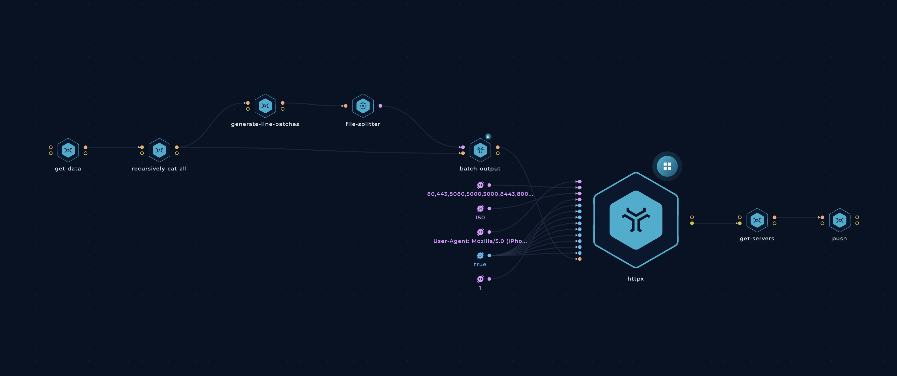
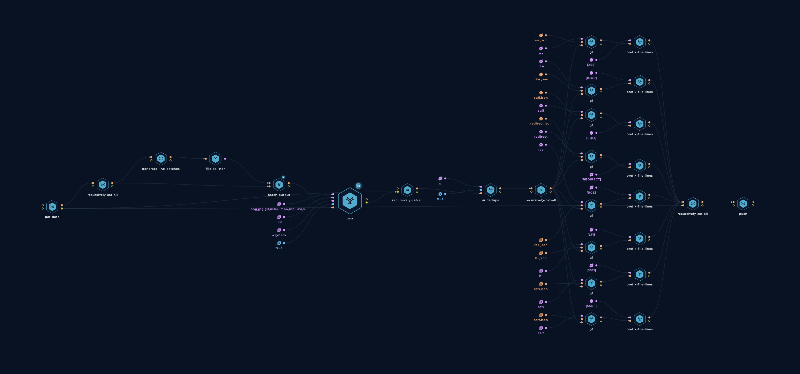
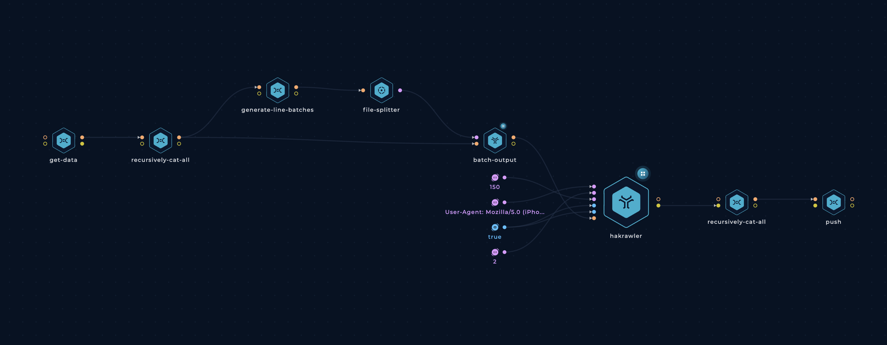
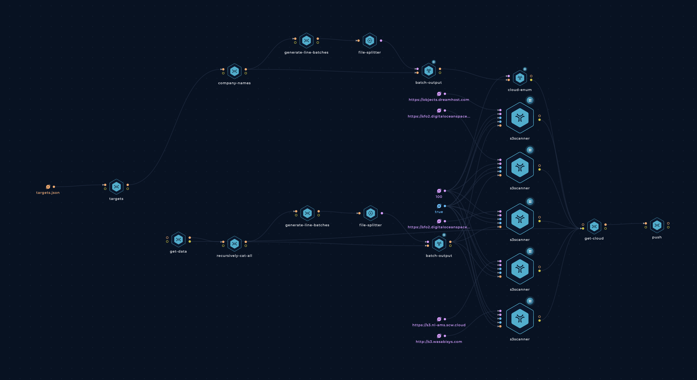

<h1 align="center">Inventory </h1>
<h3 align="center">Asset Inventory of public bug bounty programs.</h3>

The data we collect here includes hostnames, URLs, web servers, cloud assets, and more.

Our aim with this project is to:

- help bug bounty hunters get up and running on new programs as quickly as possible.
- give security teams better visibility into their assets.
- reduce the load and noise that some programs face from automated tools (we run them on schedule, give the results to everyone)

## Directory And Workflows Structure

## How it works

[Trickest](https://trickest.com) workflows pick up these targets, collects data on them, enriches it, cleans it up, and pushes it to this repository.

#### Inventory 2.0 - Hostnames

  - Get the list of domains from [targets.json](https://raw.githubusercontent.com/trickest/inventory/main/targets.json)
  - Use [subfinder](https://github.com/projectdiscovery/subfinder) and [amass](https://github.com/OWASP/Amass) to collect subdomains from passive OSINT sources (Thanks [ProjectDiscovery](https://github.com/projectdiscovery), [hakluke](https://github.com/hakluke), [OWASP](https://github.com/OWASP), and [Jeff Foley](https://github.com/caffix)!)
  - Create words from passive results gathered in previous steps
  - Find already resolved hostnames to [dsieve](https://github.com/trickest/dsieve) to collect their `main environments` (e.g. foo.admin.example.com -> admin.example.com)
  - Get pre-defined `wordlist`
  - Combine everything into one `wordlist`.
  - Use [mksub](https://github.com/trickest/mksub) to merge the `wordlist` and the `main environments` along with `root-domains` and generate DNS names.
  - Resolve DNS names using [puredns](https://github.com/d3mondev/puredns) (Thanks [d3mondev](https://github.com/d3mondev)!).
  - Generate permutations using [gotator](https://github.com/Josue87/gotator) (Thanks [Josue87](https://github.com/Josue87)!).
  - Resolve permutated DNS names using [puredns](https://github.com/d3mondev/puredns).
  - Push hostnames update

#### Inventory 2.0 - Servers

  - Probe previously found [hostnames](#Hostnames) using [httpx](https://github.com/projectdiscovery/httpx) to find live web servers on specific ports (`80,443,8080,5000,3000,8443,8000,4080,8888`) and collect their:
      - HTTP Titles
      - Status Codes
      - Content Length
      - Content Security Policies
      - Content Types
      - Final Redirect Locations
      - Webservers
      - Technologies
      - IP Addresses
      - CNAMEs
  - Parse httpx's output and organize it into files for easier navigation
  - Push to the repository

---

#### Inventory 2.0 - Urls

  - Collect URLs using newly found [hostnames](#Hostnames) with [gauplus](https://github.com/bp0lr/gauplus) (Thanks [bp0lr](https://github.com/bp0lr)!)
  - Deduplicate with [urldedupe](https://github.com/ameenmaali/urldedupe) (Thanks [ameenmaali](https://github.com/ameenmaali))
  - Use [gf](https://github.com/tomnomnom/gf) and [gf-patterns](https://github.com/1ndianl33t/Gf-Patterns) to categorize newly found URLs. (Thanks [tomnomnom](https://github.com/tomnomnom),[1ndianl33t](https://github.com/1ndianl33t)!)
  - Use `prefix-file-lines` to add a prefix for each of the vulnerability
    - IDOR
    - XSS
    - RCE
    - SQLI
    - SSTI
    - SSRF
    - REDIRECT
    - LFI
  - Push to repository

#### Inventory 2.0 - Spider

- For each target:
    - Spider URL in batches with [hakrawler](https://github.com/hakluke/hakrawler) (Thanks [hakluke](https://github.com/hakluke)!)
    - Push to repository
---

#### Inventory 2.0 - Cloud

  - Collect cloud resources using [cloud_enum](https://github.com/initstring/cloud_enum) (Thanks [initstring](https://github.com/initstring/cloud_enum)!)
  - Collected resources include
      - AWS S3 Buckets 
      - AWS Apps
      - Azure Websites
      - Azure Databases
      - Azure Containers
      - Azure VMs
      - GCP Firebase Databases
      - GCP App Enginee Apps
      - GCP Cloud Functions
      - GCP Storage Buckets
  - Use [S3Scanner](https://github.com/sa7mon/S3Scanner) to bruteforce S3-compatible buckets (using the hostnames collected to seed the wordlist)
  - Collected buckets include:
      - AWS S3 buckets
      - DigitalOcean Spaces
      - DreamHost Buckets
      - Linode Buckets
      - Scaleway Buckets
      - Wasabi Buckets
  - Save each type of resource to its own file for easier navigation.

---

> **Note**: As described, almost everything in this repository is generated automatically. We carefully designed the workflows (and continue to develop them) to ensure the results are as accurate as possible.

## Contribution
All contributions/ideas/suggestions are welcome! If you want to add/edit a target/workflow, feel free to create a new ticket via [GitHub issues](https://github.com/trickest/inventory/issues), tweet at us [@trick3st](https://twitter.com/trick3st), or join the conversation on [Discord](https://discord.gg/7HZmFYTGcQ).

## Build your own workflows!
We believe in the value of tinkering. Sign up for a demo on [trickest.com](https://trickest.com) to customize this workflow to your use case, get access to many more workflows, or build your own from scratch!

