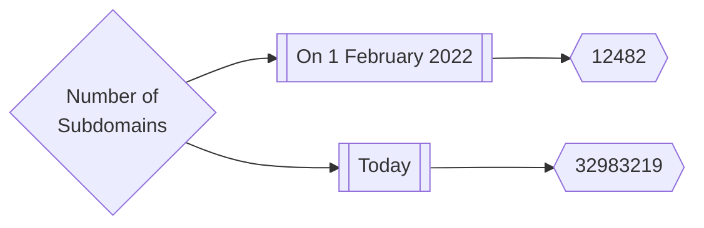
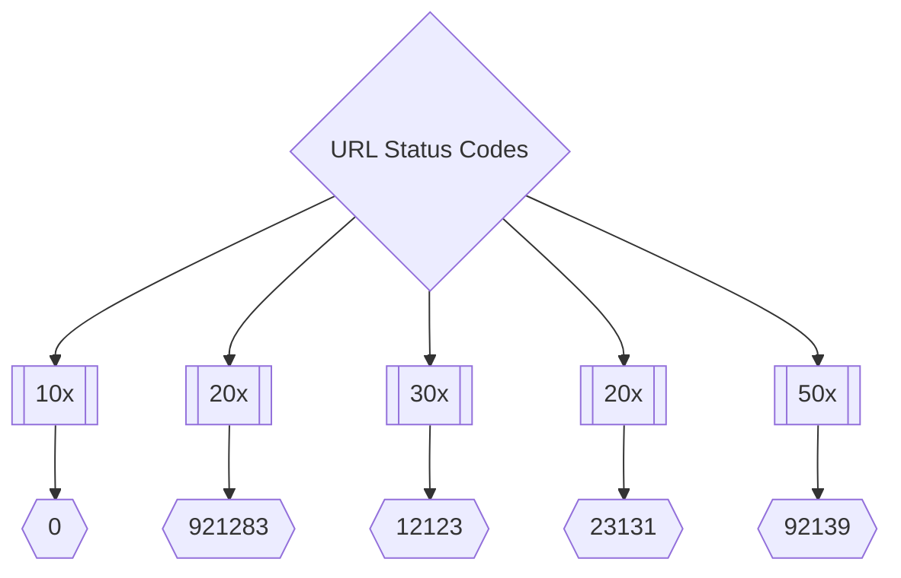
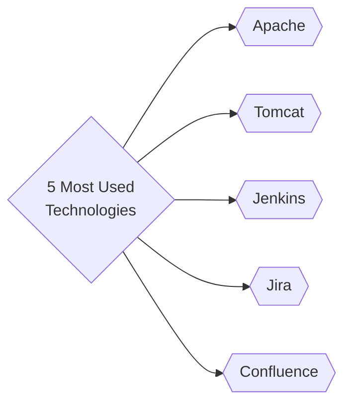

<h1 align="center">Inventory <a href="https://twitter.com/intent/tweet?text=Inventory%20-%20Asset%20Inventory%20of%20public%20bug%20bounty%20programs.%20https://github.com/trickest/inventory%20&hashtags=security,bugbounty,bugbountytips,assets,infosec,cybersecurity,recon,reconnaissance"></a></h1>
<h3 align="center">Asset Inventory of public bug bounty programs.</h3>

The data we collect here includes subdomains, URLs, web servers, cloud assets, and a lot more data on public bug bounty programs. 

Our aim with this project is to:

- help bug bounty hunters get up and running on new programs as quickly as possible.
- give security teams better visibility into their assets.
- reduce the load and noise that some programs face from automated tools (we run them on schedule, give the results to everyone)

## Statistics


---



---



---

## How it works
We have selected a few popular, public bug bounty programs as a start, and we are open to [suggestions](#contribution)!

A [Trickest](https://trickest.com) workflow picks up these targets, collects data on them, enriches it, cleans it up, and pushes it to this repository.


### TB; DZ (Too big; didn't zoom)
#### Hostnames
- Get the list of targets from [targets.json](https://raw.githubusercontent.com/trickest/inventory/main/targets.json)
- For each target:
    - Use [subfinder](https://github.com/projectdiscovery/subfinder) and [amass](https://github.com/OWASP/Amass) to collect subdomains from passive OSINT sources (Thanks [ProjectDiscovery](https://github.com/projectdiscovery), [hakluke](https://github.com/hakluke), [OWASP](https://github.com/OWASP), and [Jeff Foley](https://github.com/caffix)!)
    - Use [CeWL](https://github.com/digininja/CeWL) to crawl the main domain and generate a custom wordlist per target (Thanks [digininja](https://github.com/digininja)!).
    - Pass the found passive subdomains to [dsieve](https://github.com/trickest/dsieve) to collect their `main environments` (e.g. foo.admin.example.com -> admin.example.com). This will be used for:
      - brute-forcing per environment using wordlist from previous step
      - more permutations later
    - Combine everything found so far into one `wordlist`.
    - Use [mksub](https://github.com/trickest/mksub) to merge the `wordlist` and the `main environments` along with `root-domains` and generate DNS names.
    - Resolve DNS names using [puredns](https://github.com/d3mondev/puredns) (Thanks [d3mondev](https://github.com/d3mondev)!).
    - Generate permutations using [gotator](https://github.com/Josue87/gotator) (Thanks [Josue87](https://github.com/Josue87)!).
    - Resolve permutated DNS names using [puredns](https://github.com/d3mondev/puredns).
    - Use [anew](https://github.com/tomnomnom/anew) to pass new results to next steps (Thanks [tomnomnom](https://github.com/tomnomnom)!)

---

#### Web Servers
- For each target:
    - Probe previously found [hostnames](#Hostnames) using [httpx](https://github.com/projectdiscovery/httpx) to find live web servers on specific ports (`80,443,8080,5000,3000,8443,8000,4080,8888`) and collect their:
        - HTTP Titles
        - Status Codes
        - Content Length
        - Content Security Policies
        - Content Types
        - Final Redirect Locations
        - Webservers
        - Technologies
        - IP Addresses
        - CNAMEs
    - Parse httpx's output and organize it into files for easier navigation.
    - Crawl the found websites using [gospider](https://github.com/jaeles-project/gospider) (Thanks [jaeles-project](https://github.com/jaeles-project/gospider)!)
    - Use [LinkFinder](https://github.com/GerbenJavado/LinkFinder) for previously found `js` files to get their external links and paths. (Thanks [GerbenJavado](https://github.com/GerbenJavado)!)
    - Generate files and wordlists by their type

---

#### URLs
- For each target:
    - Collect URLs using previously found [hostnames](#Hostnames) with [gauplus](https://github.com/bp0lr/gauplus) (Thanks [bp0lr](https://github.com/bp0lr/gauplus)!)
    - Deduplicate them using [uro](https://github.com/s0md3v/uro) (Thanks [s0md3v](https://github.com/s0md3v)!)
    - Use [gf](https://github.com/tomnomnom/gf) and [gf-patterns](https://github.com/1ndianl33t/Gf-Patterns) to categorize newly found URLs. (Thanks [tomnomnom](https://github.com/tomnomnom),[1ndianl33t](https://github.com/1ndianl33t)!)
    - Save each pattern's URLs to its own file for easier navigation.
---

#### Cloud Resources
- For each target:
    - Collect cloud resources using [cloud_enum](https://github.com/initstring/cloud_enum) (Thanks [initstring](https://github.com/initstring/cloud_enum)!)
    - Collected resources include
        - AWS S3 Buckets 
        - AWS Apps
        - Azure Websites
        - Azure Databases
        - Azure Containers
        - Auzre VMs
        - GCP Firebase Databases
        - GCP App Enginee Apps
        - GCP Cloud Functions
        - GCP Storage Buckets
    - Use [S3Scanner](https://github.com/sa7mon/S3Scanner) to bruteforce S3-compatible buckets (using the hostnames collected in [Hostnames](#hostnames) to seed the wordlist)
    - Collected buckets include:
        - AWS S3 buckets
        - DigitalOcean Spaces
        - DreamHost Buckets
        - Linode Buckets
        - Scaleway Buckets
        - Wasabi Buckets
    - Save each type of resource to its own file for easier navigation.

---

#### Collection & Storage
In the end, we deduplicate and merge the results of this workflow execution with the previous executions and push them to this repository.


> **As described, almost everything in this repository is generated automatically. We carefully designed the workflows (and continue to develop them) to ensure the results are as accurate as possible.**

## Custom Usage
You can use `trickest-cli` (public release soon!) to run this workflow on a custom target(s) using the following command:
```
trickest execute Inventory --targets targets.json
```

## Contribution
All contributions/ideas/suggestions are welcome! If you want to add/edit a target/workflow, feel free to create a new ticket via [GitHub issues](https://github.com/trickest/inventory/issues), tweet at us [@trick3st](https://twitter.com/trick3st), or join the conversation on [Discord](https://discord.gg/7HZmFYTGcQ).

## Build your own workflows
We believe in the value of tinkering. Sign up for a demo on [trickest.com](https://trickest.com) to customize this workflow to your use case, get access to many more workflows, or build your own from scratch!
